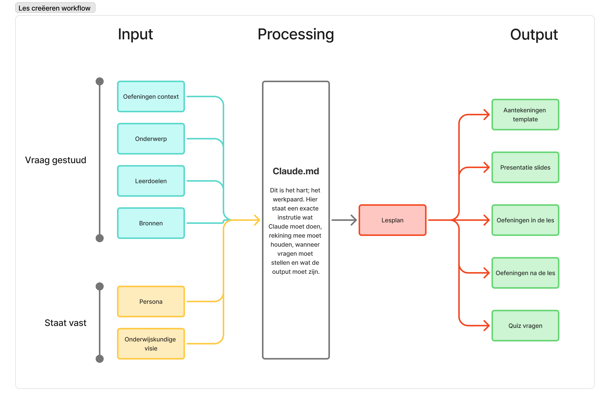

# Lesson Creation Workflow

A Claude-powered workflow for creating structured, educationally grounded lesson materials — including a lesson plan, exercises, an answer key, a self-assessment quiz, MARP slides, and a student note-taking template — from a single conversation.



## What This Repo Is

This repository contains the configuration and context files that instruct Claude on how to generate complete lesson packages. It is built around three principles:

- **Educational quality**: All lessons are grounded in Ken Bain's research-backed teaching principles (from *What the Best College Teachers Do*), as described in `.claude/context/educational_context.md`.
- **Persona-aware design**: Lessons, exercises, and quiz questions are designed with three student archetypes in mind (HAVO, MBO, and non-traditional intake), as described in `.claude/context/persona.md`.
- **Structured output**: Each lesson produces a consistent set of files organized in its own folder.

## Output per Lesson

For every lesson, Claude creates a folder `lessons/<topic-slug>/` containing:

| File                 | Description                                           |
| -------------------- | ----------------------------------------------------- |
| `lesson.md`          | Full lesson plan with learning objectives             |
| `exercises.md`       | In-class and follow-up exercises                      |
| `answers.md`         | Model answers and grading notes (teacher-facing)      |
| `quiz.md`            | 4 self-assessment questions for students (formative)  |
| `slides.md`          | MARP slide deck source                                |
| `slides.pdf`         | Rendered PDF slide deck                               |
| `notes-template.md`  | Guided Learning Log for students (Before/During/After)|

## How to Use

Open this repository in [Claude Code](https://claude.ai/code) and start a new conversation. Claude will automatically load the workflow from `CLAUDE.md` and guide you through the following steps. You can also invoke it directly with `/create-lesson`:

1. **Topic** — Describe the lesson topic, target audience, and duration
2. **Sources** — Provide URLs, local files, or references to use as input
3. **Lesson plan** — Claude creates `lesson.md` (persona-aware) and asks for your approval
4. **Exercise context** — Specify format, collaboration style, and constraints
5. **Exercises** — Claude creates `exercises.md` with in-class and follow-up exercises, plus `answers.md` with model answers and grading notes
6. **Quiz** — Claude creates `quiz.md` with 4 persona-aware self-assessment questions for students
7. **Slides** — Claude creates `slides.md` and renders it to `slides.pdf` via MARP CLI
8. **Notes template** — Claude creates `notes-template.md`, a Guided Learning Log students use before, during, and after the lesson to deepen processing

## Requirements

- [Claude Code](https://claude.ai/code) CLI
- [MARP CLI](https://github.com/marp-team/marp-cli) installed (`marp` available on PATH)

## Project Structure

```text
lesson-creation-workflow/
├── CLAUDE.md                          # Workflow instructions for Claude
├── README.md
├── workflow.png
├── lessons/                           # Generated lesson folders (one per topic)
│   └── <topic-slug>/
│       ├── lesson.md
│       ├── exercises.md
│       ├── answers.md
│       ├── quiz.md
│       ├── slides.md
│       ├── slides.pdf
│       └── notes-template.md
└── .claude/
    ├── context/
    │   ├── educational_context.md     # Bain-inspired teaching principles
    │   └── persona.md                 # Three student archetypes
    └── skills/
        └── create-lesson/
            └── SKILL.md               # /create-lesson slash command
```
