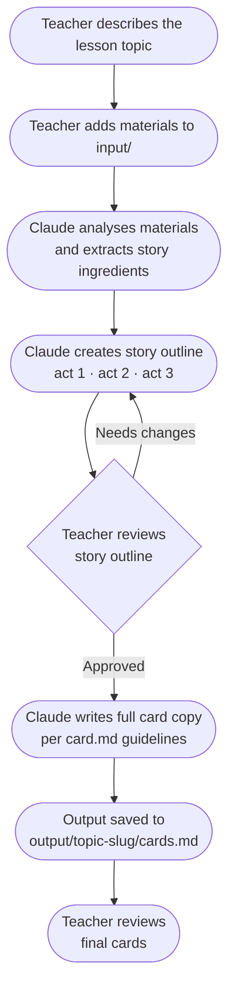

# Cheatah Cards Factory

A Claude-powered workflow for creating swipeable story cards that prepare students for class — like an Instagram story, but for learning.

Teachers provide their lesson materials. Claude analyses them and produces a story with cards students can swipe through before the lesson — arriving curious, not blank.

---

## What is a Story Card?

A **story** is a short sequence of swipeable cards (7–10 cards, ~2–3 minutes). Each **card** is a single screen: one idea, one visual, one headline. Together they form a narrative arc that hooks students, builds tension around the lesson's central question, and ends on a cliffhanger that the lesson itself will resolve.

---

## Workflow



### Steps

| Step | Who    | Action                                                                 |
| ---- | ------ | ---------------------------------------------------------------------- |
| 1    | Claude | Asks for the lesson topic and learning goal                            |
| 2    | Claude | Asks teacher to add materials to `input/`                              |
| 3    | Claude | Analyses materials — extracts concepts, hooks, tension, misconceptions |
| 4    | Claude | Creates a story outline (card-by-card arc with headline drafts)        |
| 5    | Both   | Teacher reviews and approves the outline (or requests changes)         |
| 6    | Claude | Writes full card copy following `card.md` guidelines                   |
| 7    | Claude | Saves output to `output/<topic-slug>/cards.md` and confirms            |

---

## Project Structure

```text
cheatah-cards-factory/
├── input/                        # Drop lesson materials here (PDF, PPTX, MD, notes)
├── output/
│   └── <topic-slug>/
│       └── cards.md              # Generated story cards
├── .claude/
│   └── context/
│       ├── story.md              # Story arc, length, tone, and design principles
│       ├── card.md               # Card types, anatomy, and writing principles
│       ├── educational.md        # Educational principles all content must meet
│       └── persona.md            # Student archetypes (Sanne & Elias)
└── claude.md                     # Full workflow instructions for Claude
```

---

## Story Structure

Every story follows a three-act arc:

```text
Act 1 — Hook      (1–2 cards)   Open with something surprising or recognisable
Act 2 — Build     (3–6 cards)   Develop the tension through a concrete scenario
Act 3 — Cliffhanger (1 card)   End on the central lesson question — unresolved
```

---

## Card Types

| Type         | Purpose                                              |
| ------------ | ---------------------------------------------------- |
| Hook         | Opens the story — provocative, bold, curious         |
| Situation    | Establishes the scenario and character               |
| Tension      | Introduces the conflict or knowledge gap             |
| Concept      | Names a key idea, anchored in the scenario           |
| Data         | A single striking statistic or finding               |
| Reflection   | Invites the student to pause and connect             |
| Cliffhanger  | Closes the story on the central unresolved question  |

---

## Student Archetypes

Cards are designed with two HZ business bachelor archetypes in mind:

**Sanne** — 19, straight from HAVO. Needs structure, career relevance, and a concrete anchor before abstract theory lands.

**Elias** — 24, MBO background with work experience. Needs theory connected to practice and room to bring his own experience into the story.

---

## Getting Started

1. Open this project in Claude Code
2. Type `/create-story` or ask Claude to start the story creation workflow
3. Follow the prompts — Claude will guide you through each step
